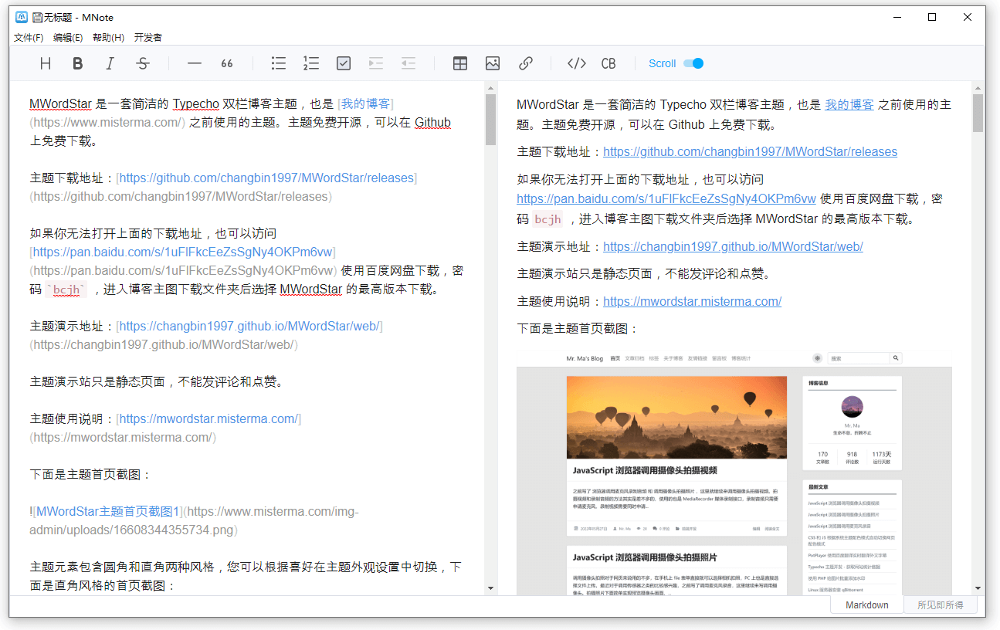

MNote 是一个基于 Electron 开发的本地 Markdown 编辑器，使用常见的两栏布局，左侧是编辑区，右侧是预览区。



开发这个编辑器主要是为了测试 TOAST UI Editor 和 Electron 的一些 API。

TOAST UI Editor 是一个前端的开源 Markdown 编辑器，我的编辑器的 Markdown 转换和显示主要就是靠 TOAST UI Editor 来实现的。

## 功能和特性

支持本地 `.md` Markdown 文件的编辑和保存，文件实现了打开、保存、另存为。

可以导出 HTML 文件，支持把 Markdown 内容导出为 `.html` 的 HTML 文件。

工具栏快速插入，点击工具栏的图标可以快速插入表格之类的内容。

代码块支持彩色高亮显示。

拖放打开文件，把 `.md` 文件拖入编辑器内可以直接打开文件。

关联本地 Markdown 文件，双击资源管理器里的 `.md` Markdown 文件可以直接使用 MNote 打开文件编辑。

## 下载说明

release 中包含打包完成的安装包和免安装程序，其中 `MNote-win-portable.zip` 是免安装程序，解压后可以直接运行 `MNote.exe` ，免安装程序不会关联文件。`MNote-win-setup.exe` 是安装包，需要安装后才能使用，安装完成后程序会关联 `.md` 的 Markdown 文件，双击文件可以直接通过 MNote 打开文件。

因为我用的是 Windows，目前也只打包了 Windows 版的。

## 运行和构建

Github 克隆：

```bash
git clone url
```

进入项目目录，安装依赖：

```bash
npm install
```

直接运行：

```bash
npm run start
```

打包为可以直接运行的 `.exe` 程序目录：

```bash
npm run pack
```

打包为安装包：

```bash
npm run dist
```

打包完成后的程序存放在项目目录下的 `release` 目录。